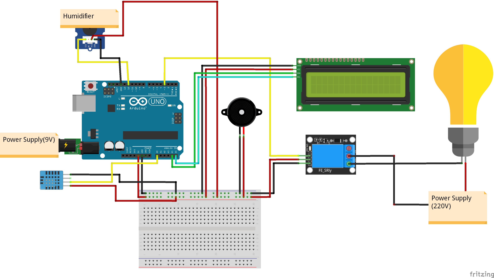

# diyEggIncubator

## 사용한 부품
1. Arduino Uno + USB 통신케이블
2. 온습도센서(DHT11)
3. 1CH 릴레이 모듈
4. 전구(20W)
5. I2C 1602 LCD
6. 능동 부저
7. 초음파 가습기 모듈
8. 무탈피커넥터(I-22)
9. 220V 전원케이블
10. 9V DC 어댑터
11. 점퍼선
12. 마이크로 5핀 케이블
13. 온습도계


## 사용된 라이브러리
아래에서 다운받을 수 있다.   

1. 
2. 
3. 


## 회로 이미지
 


## 코드
```c
#include <DHT.h> //온습도센서 라이브러리
#include <LiquidCrystal_I2C.h> //I2C LCD 라이브러리

#define DHTpin A0
#define DHTTYPE DHT11 //만약 정밀온습도센서(DHT22)를 사용한다면 DHT22로 적어준다. 
#define RELAYpin 3 //릴레이모듈 핀
#define Buzz 5 //부저 핀
#define Hum 4 //가습기모듈 핀

//객체 생성
DHT dht(DHTpin, DHTTYPE);
LiquidCrystal_I2C lcd(0x27, 16, 2);

unsigned long prev_time=0; //millis()에서 사용할 이전시간 변수

void setup (){

  pinMode(RELAYpin, OUTPUT);
  digitalWrite(RELAYpin, HIGH); 

  pinMode(Hum, OUTPUT);
  
  pinMode(Buzz, OUTPUT);
  digitalWrite(Buzz, HIGH);//아두이노 전원 켰을 때 부저로 1초 소리내기
  delay(1000);
  digitalWrite(Buzz, LOW);
  
  
  dht.begin();
  lcd.init();
  lcd.backlight();
}
  
  

void loop (){
 
  
  float t = dht.readTemperature(); //온도 읽기
  float h = dht.readHumidity(); //습도 읽기
  
  float tC = dht.computeHeatIndex(t, h, false); //온도 정밀도 높이기

  int t_Lthres = 35; //최저온도 기준
  int t_Hthres = 39; //최고온도 기준

  unsigned long oneH = 3600000; //1시간을 ms 기준으로 환산

	//millis() 함수가 현재시간(아두이노 시작부터 경과된 시간)을 ms단위로 리턴
  unsigned long current_time = millis();

	//lcd화면에 온도와 습도 나타내기
  lcd.setCursor(0,0);
  lcd.print("T:");
  lcd.print(t);
  lcd.print("(C)");
  lcd.setCursor(0,1);
  lcd.print("H:");
  lcd.print(h);
  lcd.print("(%)");

  //전구제어: 38도가 넘으면 전구를 끄고, 35도 아래로 내려가면 다시 켬
  if(t>t_Hthres) digitalWrite(RELAYpin, HIGH);
  else if(t<t_Lthres) digitalWrite(RELAYpin, LOW);

  //습도 조절: 65%가 넘으면 가습기센서를 끄고, 50% 아래로 내려가면 다시 켬
  if(h<50) digitalWrite(Hum, HIGH);
  else if(h>65) digitalWrite(Hum, LOW);

  
  //부저로 전란알람
  if(current_time - prev_time > oneH*3){//X시간(oneH*X)이 지났을 경우 부저로 전란알림
    for(int i=0;i<3;i++){
      digitalWrite(Buzz, HIGH);
      delay(400);
      digitalWrite(Buzz, LOW);
      delay(400);
    } 
    prev_time = current_time; //X시간이 지난 후에는 현재시간을 지난시간에 저장함
  }

  delay(100);

}
```


유튜브링크 : https://youtu.be/B8f_P1lXJ2U
